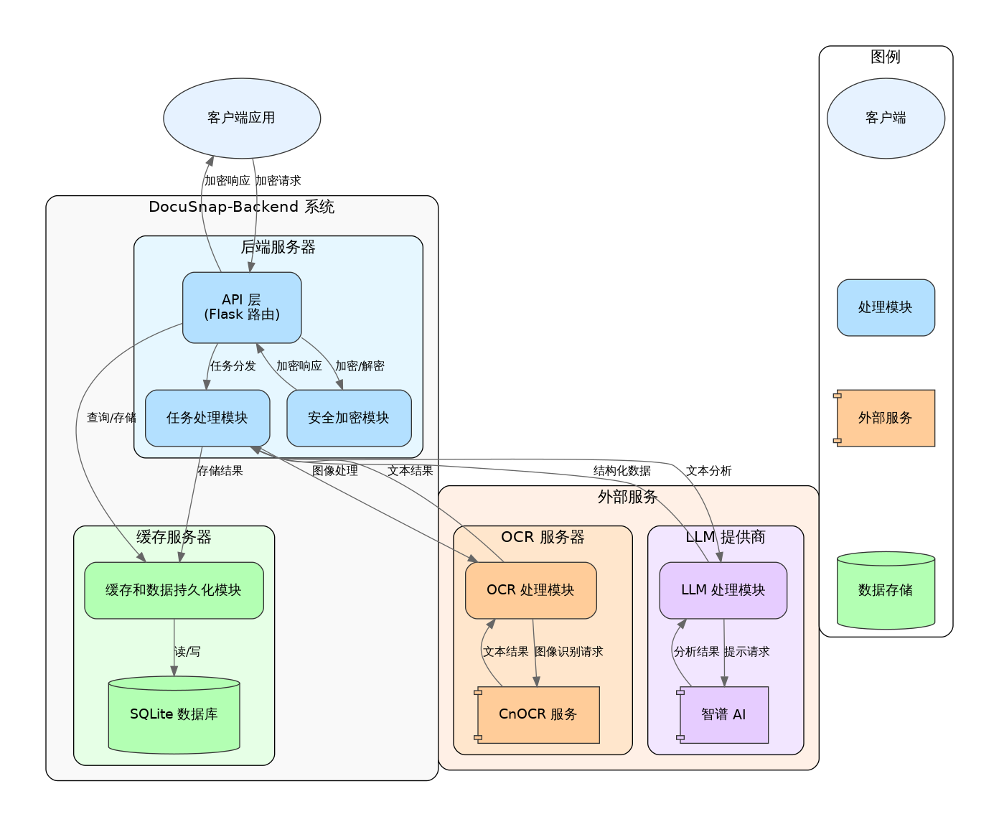

# Architecture Overview

DocuSnap-Backend employs a three-layer architecture that combines layered architecture with microservice concepts, effectively breaking down system functionality into collaborating components. This page provides a high-level overview of the system architecture.

## Architectural Style

The architectural style of DocuSnap-Backend can be described as:

**A hybrid of layered architecture and microservices architecture**

- **Layered Architecture**: The system internally adopts clear functional layering, including API layer, business logic layer, data access layer, etc.
- **Microservice Concepts**: The system treats OCR processing as an independent service, interacting via API, reflecting microservice design principles
- **REST API Pattern**: The system communicates with clients and external services through RESTful APIs

This hybrid architecture combines the simplicity of layered architecture with the flexibility of microservices architecture, suitable for DocuSnap-Backend's functional requirements and scale.

## System Components

DocuSnap-Backend consists of three main components:

1. **Backend Server**:
   - Core application server, based on Flask framework
   - Handles client requests, coordinates task processing
   - Manages task queues and worker threads
   - Implements security encryption and data caching

2. **OCR Server**:
   - Independent OCR processing service
   - Uses CnOCR for text recognition
   - Processes image-to-text requests
   - Interacts with the backend server as a microservice

3. **LLM Provider**:
   - External LLM service (Zhipu AI)
   - Provides natural language processing capabilities
   - Interacts with the backend server via API
   - Processes text analysis and information extraction

## System Architecture Diagram

The following diagram shows the overall architecture of DocuSnap-Backend:

## Architectural Characteristics

DocuSnap-Backend's architecture has the following main characteristics:

### 1. Separation of Concerns

- **Functional Modularity**: System functionality is broken down into independent modules, such as task processing, OCR processing, LLM processing, etc.
- **Service Separation**: OCR processing is treated as an independent service, reducing the burden on the core application
- **Clear Responsibilities**: Each component and module has clear responsibilities and boundaries

### 2. Asynchronous Processing

- **Task Queue**: Uses queues to store pending tasks, decoupling request reception and processing
- **Worker Threads**: Uses thread pools to process tasks in parallel, improving system throughput
- **Non-blocking Design**: Clients can query task status asynchronously, avoiding long wait times

### 3. Security Mechanisms

- **End-to-end Encryption**: Uses RSA and AES hybrid encryption to protect data transmission
- **Request Validation**: Uses SHA256 hash to verify the integrity of requests
- **Multi-layer Security**: Includes parameter validation, content validation, encryption protection, and other multi-layer security mechanisms

### 4. Caching Strategy

- **Result Caching**: Uses SQLite to store task results, avoiding repeated computation
- **Status Management**: Records task status, supports status queries and result retrieval
- **Cache Cleanup**: Regularly cleans up expired caches, optimizing storage space

### 5. Scalability

- **Modular Design**: Facilitates adding new features and extending existing ones
- **Service Independence**: OCR service can be scaled independently without affecting the core application
- **Externalized Configuration**: Key parameters are managed through configuration files, facilitating adjustment and optimization

## Architecture Decisions

The following key decisions were made when designing the DocuSnap-Backend architecture:

1. **Choosing a Lightweight Framework**:
   - Using Flask rather than full-featured frameworks like Django, reducing unnecessary complexity
   - Suitable for the system's API service positioning and scale

2. **Adopting a Three-layer Architecture**:
   - Dividing the system into backend server, OCR server, and LLM provider layers
   - Clear separation of responsibilities, facilitating maintenance and extension

3. **Asynchronous Task Processing**:
   - Using task queues and worker threads to handle time-consuming operations
   - Improving system responsiveness and concurrent processing capability

4. **End-to-end Encryption**:
   - Implementing a complete end-to-end encryption solution to protect sensitive data
   - Using RSA and AES hybrid encryption, balancing security and performance

5. **Using SQLite as Cache**:
   - Choosing lightweight SQLite as cache storage rather than complex database systems
   - Suitable for the system's caching needs and scale

These architecture decisions collectively shape the overall design of DocuSnap-Backend, enabling it to effectively meet document and form processing requirements while maintaining system simplicity, security, and scalability.
