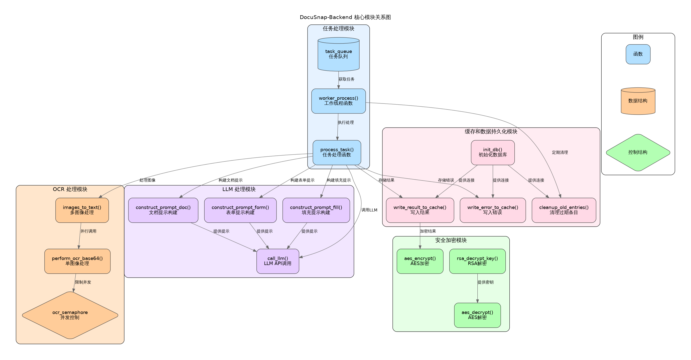

# Module Overview

The DocuSnap-Backend system consists of five core functional modules that work together to implement the system's main features. This page provides an overview of these core modules.

## Core Module Composition

Through analysis of the DocuSnap-Backend codebase, we have identified the following five core functional modules:

1. **Task Processing Module**: Manages task queues, allocates worker threads, and coordinates asynchronous task processing
2. **OCR Processing Module**: Processes image recognition requests and converts images to text
3. **LLM Processing Module**: Builds prompts, calls LLM API, and processes LLM responses
4. **Security & Encryption Module**: Implements end-to-end encryption and protects data transmission security
5. **Cache & Persistence Module**: Manages storage, retrieval, and cleanup of task status and results

These modules together form the core functional architecture of DocuSnap-Backend, with each module responsible for a specific functional area and interacting through clear interfaces and data flows.

## Module Relationship Diagram

The following diagram shows the relationships and interactions between the five core modules:

From the diagram, we can see that:

- The **Task Processing Module** is at the center of the system, coordinating the work of other modules
- The **OCR Processing Module** and **LLM Processing Module** work closely together to complete document and form processing
- The **Security & Encryption Module** and **Cache & Persistence Module** provide support services for other modules
- All modules interact with the **Task Processing Module**, forming a coordinated working whole

## Module Responsibilities Overview

### 1. Task Processing Module

The Task Processing Module is the core coordinator of the system, responsible for managing the lifecycle and workflow of tasks.

**Main Responsibilities**:
- Receiving and validating client requests
- Managing task queues and task status
- Coordinating the allocation and execution of worker threads
- Implementing processing strategies for different types of tasks
- Coordinating the work of other modules

**Key Components**:
- Task queue
- Worker thread pool
- Task status management
- Processing strategy selector

### 2. OCR Processing Module

The OCR Processing Module is responsible for image text recognition, converting document and form images into text content.

**Main Responsibilities**:
- Handling image preprocessing and format conversion
- Calling OCR services for text recognition
- Processing multiple images in parallel
- Merging and organizing OCR results

**Key Components**:
- OCR service client
- Image processing tools
- Parallel processing controller
- Result merger

### 3. LLM Processing Module

The LLM Processing Module is responsible for text analysis and information extraction, utilizing the capabilities of large language models to understand document content.

**Main Responsibilities**:
- Building appropriate prompts based on task type
- Calling LLM API for text analysis
- Parsing and processing LLM responses
- Generating structured processing results

**Key Components**:
- Prompt builder
- LLM API client
- Response parser
- Result formatter

### 4. Security & Encryption Module

The Security & Encryption Module is responsible for protecting the security of the system and data, implementing end-to-end encryption and request validation.

**Main Responsibilities**:
- Implementing RSA and AES hybrid encryption
- Validating the integrity and authenticity of requests
- Protecting the security of sensitive data transmission
- Managing encryption keys and security configurations

**Key Components**:
- RSA encryptor/decryptor
- AES encryptor/decryptor
- Hash validator
- Key manager

### 5. Cache & Persistence Module

The Cache & Persistence Module is responsible for managing the storage and retrieval of system data, improving system performance and reliability.

**Main Responsibilities**:
- Managing SQLite database connections
- Storing and retrieving task status and results
- Implementing caching mechanisms to avoid repeated computation
- Periodically cleaning up expired data

**Key Components**:
- Database connection manager
- Task data store
- Cache query handler
- Data cleaner

## Module Design Principles

The core module design of DocuSnap-Backend follows these principles:

1. **Single Responsibility Principle**: Each module focuses on a specific functional area
2. **Clear Interface Principle**: Modules interact through clearly defined interfaces
3. **Low Coupling, High Cohesion Principle**: Reducing dependencies between modules while enhancing functional associations within modules
4. **Extensibility Principle**: Module design facilitates extension and addition of new features
5. **Testability Principle**: Module functions can be independently tested and verified

Through these design principles, DocuSnap-Backend has achieved a modular architecture that is structurally clear, functionally well-defined, and easy to maintain and extend.

In the following pages, we will provide detailed descriptions of the design, implementation, and key code examples for each core module.
