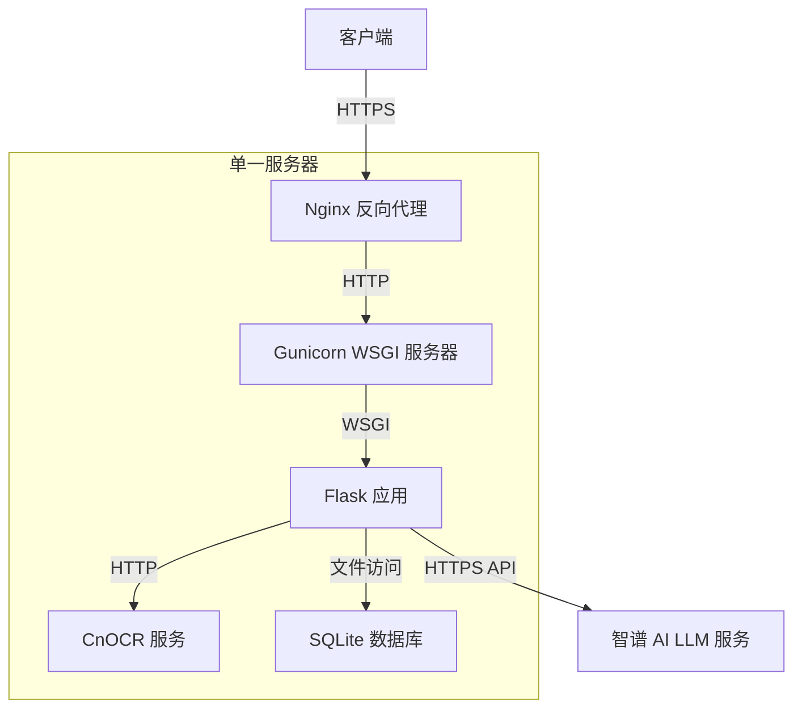
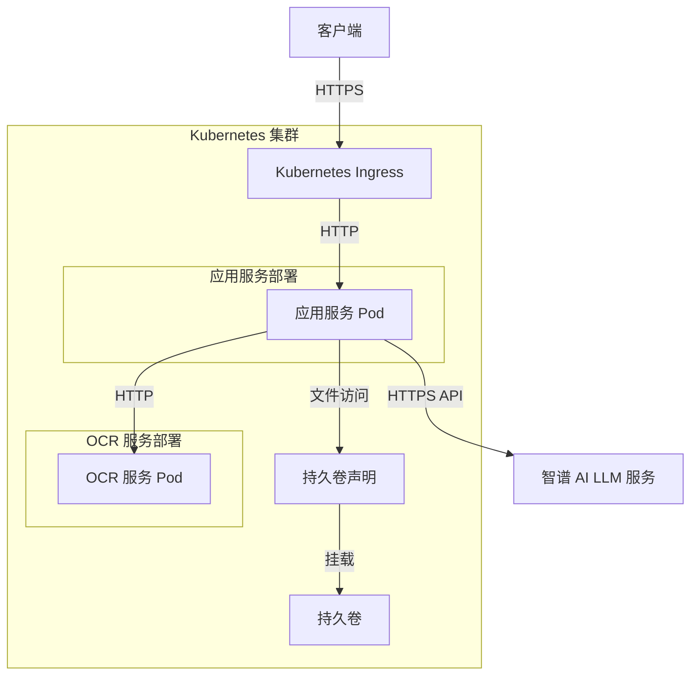
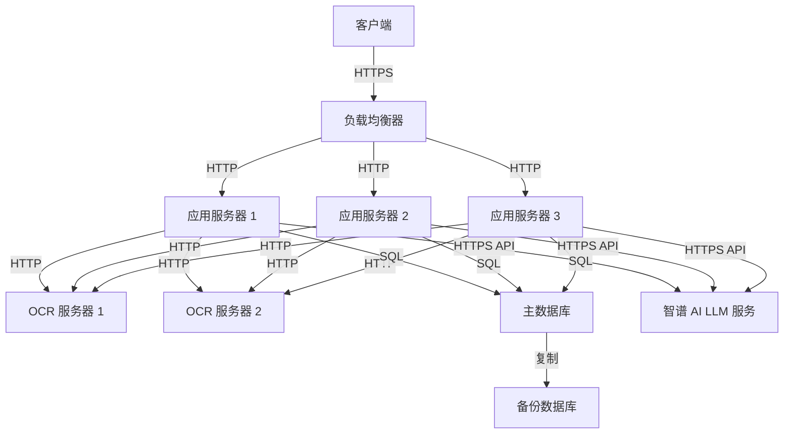
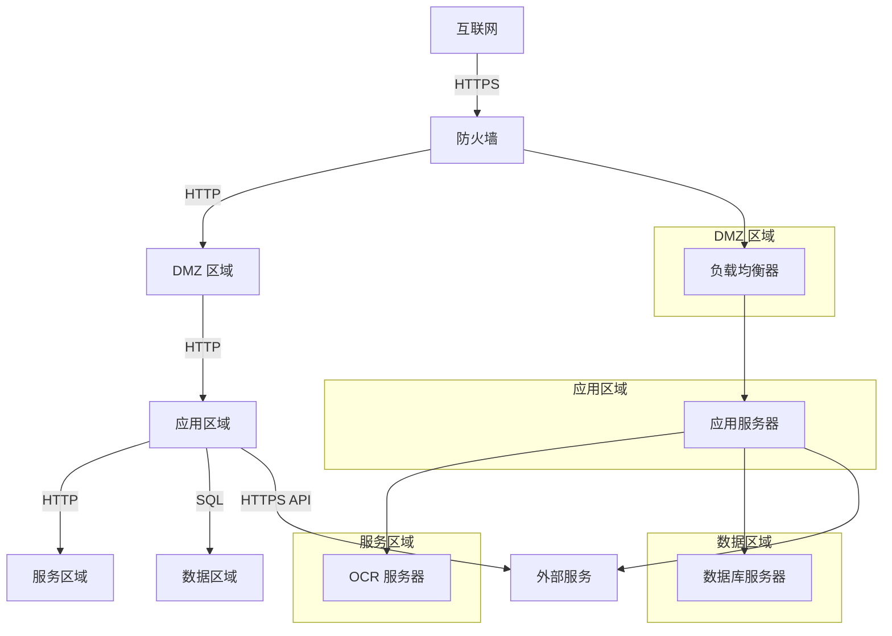
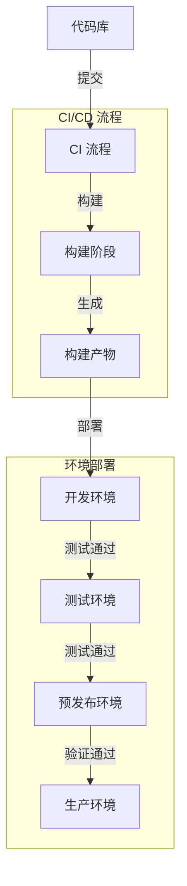

# 部署图

本页面详细介绍 DocuSnap-Backend 系统的部署架构图，包括组件关系、网络拓扑和数据流向。

## 整体部署架构图

下图展示了 DocuSnap-Backend 系统在生产环境中的整体部署架构：

### 图解说明

1. **客户端层**：
   - 位于最左侧，包括 Web 客户端、移动客户端和第三方应用
   - 通过 HTTPS 协议与系统交互
   - 使用端到端加密保护数据传输安全

2. **负载均衡层**：
   - 位于客户端和应用服务层之间
   - 使用 Nginx 实现反向代理和负载均衡
   - 分发请求到多个应用服务实例
   - 提供 SSL 终结、请求过滤和基本安全防护

3. **应用服务层**：
   - 位于系统的核心位置
   - 包含多个 Flask 应用实例
   - 每个实例使用 Gunicorn 作为 WSGI 服务器
   - 处理客户端请求，协调任务处理

4. **OCR 服务层**：
   - 位于应用服务层右侧
   - 包含多个 CnOCR 服务实例
   - 提供图像文本识别功能
   - 可以独立扩展，满足不同的处理需求

5. **数据存储层**：
   - 位于底部，为应用服务层提供数据存储
   - 包括 SQLite 数据库和文件存储
   - 存储任务状态、处理结果和临时数据
   - 支持数据备份和恢复

6. **外部服务层**：
   - 位于右侧，包括智谱 AI LLM 服务
   - 通过 API 与应用服务层交互
   - 提供文本分析和信息提取能力

### 组件连接

图中的连接线表示组件之间的通信关系：

- **客户端 → 负载均衡层**：HTTPS 协议，端口 443
- **负载均衡层 → 应用服务层**：HTTP 协议，端口 8000（Gunicorn）
- **应用服务层 → OCR 服务层**：HTTP 协议，端口 5001
- **应用服务层 → 数据存储层**：SQLite 文件访问
- **应用服务层 → 外部服务层**：HTTPS 协议，智谱 AI API

### 扩展性设计

图中的虚线框和重复组件表示系统的扩展性设计：

- **应用服务实例**：可以水平扩展，增加实例数量
- **OCR 服务实例**：可以独立扩展，满足不同的处理需求
- **负载均衡**：支持动态添加和移除后端服务实例

## 单机部署图

以下是 DocuSnap-Backend 系统的单机部署架构图，适合开发、测试和小规模使用场景：

### 图解说明

1. **单一服务器**：
   - 所有组件（除外部 LLM 服务外）部署在同一台服务器上
   - 简化了部署和维护，但限制了扩展性和容错性
   - 适合低并发、低负载场景

2. **组件关系**：
   - Nginx 作为反向代理，处理客户端请求
   - Gunicorn 作为 WSGI 服务器，运行 Flask 应用
   - Flask 应用实现核心业务逻辑
   - CnOCR 服务提供图像文本识别
   - SQLite 数据库存储任务状态和结果
   - 智谱 AI LLM 服务作为外部服务提供文本分析能力

## 容器化部署图

以下是 DocuSnap-Backend 系统的容器化部署架构图，使用 Docker 和 Kubernetes 等容器技术：

### 图解说明

1. **Kubernetes 集群**：
   - 使用容器编排系统管理应用组件
   - 支持自动扩展、自愈和滚动更新
   - 提高系统可靠性和可维护性

2. **组件关系**：
   - Kubernetes Ingress 作为入口点，处理外部流量
   - 应用服务和 OCR 服务作为独立的部署
   - 持久卷提供数据存储，确保数据持久性
   - 外部 LLM 服务通过 API 集成

3. **扩展性设计**：
   - 可以独立扩展应用服务和 OCR 服务
   - 使用水平 Pod 自动缩放（HPA）根据负载自动调整实例数量
   - 支持跨节点部署，提高可用性

## 高可用部署图

以下是 DocuSnap-Backend 系统的高可用部署架构图，适合生产环境和大规模使用场景：

### 图解说明

1. **多服务器部署**：
   - 应用服务器、OCR 服务器和数据库服务器分离部署
   - 每种服务都有多个实例，提高可用性和容错性
   - 支持大规模并发处理

2. **负载均衡**：
   - 使用负载均衡器分发客户端请求
   - 支持会话保持和健康检查
   - 提供故障转移和自动恢复

3. **数据库高可用**：
   - 主数据库处理读写操作
   - 备份数据库通过复制保持数据同步
   - 支持故障转移和数据恢复

4. **扩展性设计**：
   - 可以独立扩展应用服务器和 OCR 服务器
   - 根据负载动态调整实例数量
   - 支持跨区域部署，提高可用性

## 网络拓扑图

以下是 DocuSnap-Backend 系统的网络拓扑图，展示了不同网络区域和安全边界：

### 图解说明

1. **网络分区**：
   - DMZ 区域：面向外部，包含负载均衡器
   - 应用区域：包含应用服务器
   - 服务区域：包含 OCR 服务器
   - 数据区域：包含数据库服务器

2. **安全边界**：
   - 防火墙控制外部访问
   - 不同区域之间有网络隔离
   - 只允许必要的通信路径

3. **通信路径**：
   - 客户端只能通过 HTTPS 访问负载均衡器
   - 应用服务器可以访问 OCR 服务器、数据库服务器和外部服务
   - 数据库服务器只接受来自应用服务器的连接

## 部署流程图

以下是 DocuSnap-Backend 系统的部署流程图，展示了从代码到生产环境的完整流程：

### 图解说明

1. **CI/CD 流程**：
   - 代码提交触发 CI 流程
   - 构建阶段生成部署产物
   - 自动化测试验证代码质量

2. **环境部署**：
   - 开发环境：用于开发和初步测试
   - 测试环境：用于功能测试和集成测试
   - 预发布环境：用于性能测试和验收测试
   - 生产环境：面向最终用户

3. **部署策略**：
   - 逐级部署，确保每个环境都经过验证
   - 自动化部署减少人为错误
   - 支持回滚机制，确保系统稳定性

## 总结

DocuSnap-Backend 系统的部署架构设计考虑了可扩展性、可靠性和安全性等多方面因素。根据不同的使用场景和需求，可以选择单机部署、分布式部署或容器化部署等不同模式。通过合理的组件分离和网络设计，系统能够支持从小规模测试到大规模生产的各种部署场景，提供高效、可靠的文档和表单处理服务。