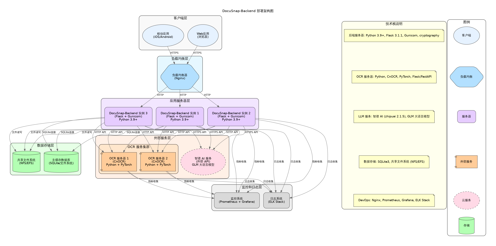

# Deployment Overview

This page provides an overview of the DocuSnap-Backend system deployment in a production environment, including deployment architecture, component relationships, and key considerations.

## Deployment Architecture

The DocuSnap-Backend system adopts a layered deployment architecture, separating different functional components to improve system scalability, reliability, and maintainability. The overall deployment architecture is shown in the following diagram:

This deployment architecture includes the following main components:

1. **Client Layer**:
   - Web clients
   - Mobile clients
   - Third-party applications

2. **Load Balancing Layer**:
   - Nginx reverse proxy
   - Load balancer

3. **Application Service Layer**:
   - Flask application instances
   - Gunicorn WSGI server

4. **OCR Service Layer**:
   - CnOCR service instances

5. **Data Storage Layer**:
   - SQLite database
   - File storage

6. **External Service Layer**:
   - Zhipu AI LLM service

## Deployment Modes

The DocuSnap-Backend system supports the following deployment modes:

### 1. Single-Server Deployment

Suitable for development, testing, and small-scale usage scenarios.

**Characteristics**:
- All components deployed on a single server
- Simple to deploy and maintain
- Shared resources, low cost
- Suitable for low concurrency, low load scenarios

**Deployment Steps**:
1. Install necessary dependencies (Python, Flask, SQLite, etc.)
2. Clone the repository and configure the environment
3. Start the Flask application and OCR service
4. Configure Nginx as a reverse proxy (optional)

### 2. Distributed Deployment

Suitable for production environments and large-scale usage scenarios.

**Characteristics**:
- Components distributed across multiple servers
- Can scale each component independently
- Improves system reliability and fault tolerance
- Suitable for high concurrency, high load scenarios

**Deployment Steps**:
1. Deploy load balancing layer (Nginx)
2. Deploy multiple application service instances
3. Deploy multiple OCR service instances
4. Configure data storage layer
5. Configure external service connections

### 3. Containerized Deployment

Using container technologies such as Docker and Kubernetes for deployment.

**Characteristics**:
- Environment consistency and isolation
- Facilitates automated deployment and scaling
- High resource utilization
- Suitable for cloud environments and microservice architectures

**Deployment Steps**:
1. Create Docker images (application service, OCR service)
2. Write Docker Compose or Kubernetes configurations
3. Deploy container orchestration system
4. Configure service discovery and load balancing

## Deployment Requirements

### Hardware Requirements

**Minimum Configuration** (Single-server deployment):
- CPU: 4 cores
- Memory: 8 GB
- Storage: 50 GB SSD
- Network: 100 Mbps

**Recommended Configuration** (Distributed deployment):
- Application Server:
  - CPU: 8+ cores
  - Memory: 16+ GB
  - Storage: 100+ GB SSD
  - Network: 1+ Gbps
- OCR Server:
  - CPU: 8+ cores
  - Memory: 16+ GB (GPU version requires GPU support)
  - Storage: 100+ GB SSD
  - Network: 1+ Gbps

### Software Requirements

**Operating System**:
- Linux (recommended Ubuntu 20.04+ or CentOS 8+)
- Windows Server supported, but not recommended for production environments

**Runtime Environment**:
- Python 3.8+
- pip 20.0+
- virtualenv or conda (recommended)

**Web Server**:
- Nginx 1.18+
- Gunicorn 20.0+

**Database**:
- SQLite 3.30+ (default)
- Optional: PostgreSQL 12+ (recommended for large-scale deployments)

**Container Platform** (optional):
- Docker 19.0+
- Docker Compose 1.25+
- Kubernetes 1.18+ (recommended for distributed deployments)

## Network Configuration

### Port Configuration

**External Ports**:
- HTTP: 80 (redirects to HTTPS)
- HTTPS: 443

**Internal Ports**:
- Flask application: 5000 (default)
- Gunicorn: 8000 (default)
- OCR service: 5001 (default)

### Network Security

**Recommended Configuration**:
- Enable HTTPS, using TLS 1.2+
- Configure appropriate CORS policies
- Use Web Application Firewall (WAF)
- Implement IP restrictions and access controls
- Regularly update security patches

## Scalability Considerations

The DocuSnap-Backend system design supports both horizontal and vertical scaling:

### Horizontal Scaling

- **Application Service Layer**:
  - Increase the number of application service instances
  - Use load balancing to distribute requests
  - Stateless design facilitates scaling

- **OCR Service Layer**:
  - Increase the number of OCR service instances
  - Use load balancing to distribute requests
  - Can be scaled on demand

### Vertical Scaling

- **Increase Single Machine Resources**:
  - Upgrade CPU, memory, and storage
  - Suitable for low to medium load scenarios
  - Simple to implement, but limited scalability

### Database Scaling

- **SQLite Limitations**:
  - Suitable for small to medium-scale deployments
  - Limited concurrent write performance
  - Does not support distributed deployment

- **Upgrade to PostgreSQL** (recommended for large-scale deployments):
  - Supports high concurrent read and write operations
  - Supports master-slave replication and sharding
  - Better data management and backup mechanisms

## Monitoring and Maintenance

### Monitoring Metrics

**System Metrics**:
- CPU usage
- Memory usage
- Disk I/O
- Network traffic

**Application Metrics**:
- Request response time
- Request success rate
- Task queue length
- Task processing time
- OCR and LLM service response times

### Log Management

**Log Types**:
- Application logs
- Access logs
- Error logs
- Security logs

**Log Configuration**:
- Use structured log formats (such as JSON)
- Configure appropriate log levels
- Implement log rotation policies
- Consider using centralized log management systems (such as ELK stack)

### Backup Strategy

**Backup Content**:
- Database files
- Configuration files
- Key files
- Application code

**Backup Frequency**:
- Database: Daily incremental backups, weekly full backups
- Configuration and keys: Backup after each modification
- Application code: Backup before each deployment

## Deployment Checklist

The following is a high-level checklist for deploying the DocuSnap-Backend system:

1. **Prepare Environment**:
   - Set up servers and network
   - Install necessary software and dependencies
   - Configure firewall and security policies

2. **Deploy Application Service**:
   - Clone the repository
   - Configure environment variables and configuration files
   - Install Python dependencies
   - Set up Gunicorn and Nginx

3. **Deploy OCR Service**:
   - Install CnOCR and its dependencies
   - Configure OCR service
   - Set up service auto-start

4. **Configure Database**:
   - Initialize SQLite database
   - Set database permissions
   - Configure backup strategy

5. **Configure External Services**:
   - Set up Zhipu AI API keys
   - Configure connection parameters
   - Test connections

6. **Set Up Monitoring**:
   - Configure system monitoring
   - Set up application monitoring
   - Configure alert mechanisms

7. **Test and Verify**:
   - Functional testing
   - Performance testing
   - Security testing

8. **Go Live**:
   - Switch traffic
   - Monitor system status
   - Prepare rollback plan

Through this layered deployment architecture and flexible deployment modes, the DocuSnap-Backend system can adapt to usage scenarios of different scales and requirements, providing efficient and reliable document and form processing services.
