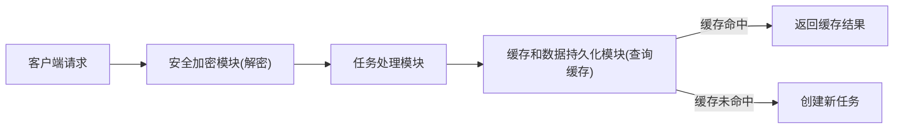
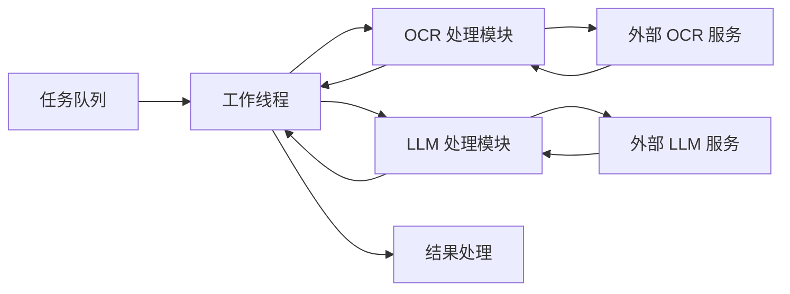
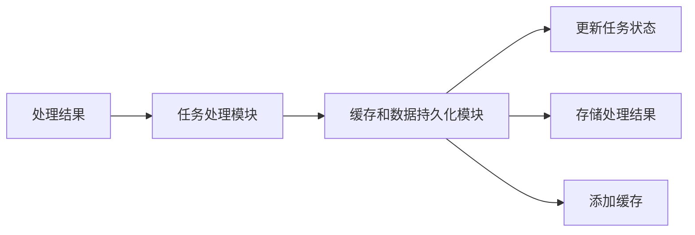
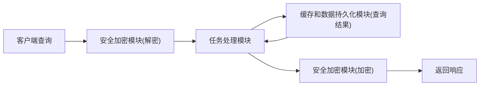

# 数据流图

DocuSnap-Backend 系统中的数据流是理解系统工作原理的关键。本页面详细介绍系统中数据的流动路径、处理步骤和转换过程。

## 整体数据流

下图展示了 DocuSnap-Backend 系统的整体数据流，从客户端请求到响应的完整路径：


这个数据流图展示了系统中数据的主要流动路径，包括请求处理、任务执行、结果存储和响应处理等阶段。

## 主要数据流路径

### 1. 请求处理路径



请求处理路径描述了系统如何接收和处理客户端请求：

1. **客户端发送请求**：
   - 客户端通过 API 端点发送加密请求
   - 请求包含加密的数据、加密的 AES 密钥和签名

2. **请求解密**：
   - 安全加密模块使用 RSA 私钥解密 AES 密钥
   - 使用 AES 密钥解密请求数据
   - 验证请求签名，确保数据完整性

3. **请求验证**：
   - 任务处理模块验证请求参数
   - 检查参数格式和内容
   - 确保请求符合系统要求

4. **缓存检查**：
   - 根据请求参数生成缓存键
   - 查询数据库是否有匹配的缓存结果
   - 如果缓存命中，直接返回缓存结果

5. **任务创建**：
   - 如果缓存未命中，生成唯一的任务 ID
   - 创建任务记录，设置状态为"待处理"
   - 将任务添加到处理队列

### 2. 任务执行路径



任务执行路径描述了系统如何处理队列中的任务：

1. **任务分配**：
   - 工作线程从队列获取任务
   - 根据任务类型选择处理策略
   - 更新任务状态为"处理中"

2. **OCR 处理**：
   - 解码 Base64 图像
   - 调用 OCR 服务进行文本识别
   - 并行处理多个图像
   - 合并 OCR 结果

3. **LLM 处理**：
   - 根据任务类型构建提示
   - 调用 LLM API 进行文本分析
   - 解析 LLM 响应
   - 提取结构化数据

4. **结果处理**：
   - 格式化处理结果
   - 添加元数据
   - 确保输出格式的一致性

### 3. 结果存储路径



结果存储路径描述了系统如何存储和管理处理结果：

1. **任务状态更新**：
   - 更新任务状态为"已完成"或"错误"
   - 记录更新时间戳
   - 更新任务处理进度

2. **结果存储**：
   - 将处理结果存储到数据库
   - 关联结果与任务 ID
   - 确保数据持久化

3. **缓存管理**：
   - 将结果添加到缓存
   - 设置缓存键和过期时间
   - 优化后续相同请求的响应速度

### 4. 响应处理路径



响应处理路径描述了系统如何处理客户端的查询请求：

1. **查询接收**：
   - 客户端通过 API 端点发送查询请求
   - 请求包含任务 ID 和认证信息
   - 系统解密和验证请求

2. **结果检索**：
   - 根据任务 ID 查询任务状态和结果
   - 从数据库获取存储的结果
   - 准备响应数据

3. **响应加密**：
   - 使用 AES 密钥加密响应数据
   - 计算响应数据的签名
   - 构建加密响应

4. **响应返回**：
   - 返回加密的响应和签名给客户端
   - 客户端解密响应并验证签名
   - 客户端处理响应数据

## 数据转换过程

在数据流动过程中，数据经历了多次转换：

### 1. 图像到文本转换

```
Base64 图像 → 二进制图像 → OCR 处理 → 文本内容
```

这个转换过程由 OCR 处理模块完成，将文档和表单图像转换为文本内容。

### 2. 文本到结构化数据转换

```
文本内容 → LLM 提示 → LLM 处理 → 结构化数据
```

这个转换过程由 LLM 处理模块完成，将文本内容转换为结构化的 JSON 数据。

### 3. 用户信息到表单填充转换

```
表单结构 + 用户信息 → 信息匹配 → 填充表单
```

这个转换过程在表单自动填充流程中完成，将用户提供的信息与表单字段匹配，生成填充后的表单数据。

## 数据流中的安全措施

DocuSnap-Backend 系统在数据流的各个环节实施了安全措施：

1. **传输安全**：
   - 使用 RSA 和 AES 混合加密保护数据传输
   - 使用 SHA256 哈希验证数据完整性
   - 防止数据泄露和篡改

2. **存储安全**：
   - 敏感数据加密存储
   - 访问控制和权限管理
   - 定期清理过期数据

3. **处理安全**：
   - 输入验证和过滤
   - 错误处理和异常管理
   - 资源限制和并发控制

## 数据流中的性能优化

DocuSnap-Backend 系统在数据流的各个环节实施了性能优化：

1. **并行处理**：
   - 并行处理多个图像
   - 使用线程池提高处理效率
   - 控制并发度，避免资源过度消耗

2. **缓存机制**：
   - 缓存处理结果，避免重复计算
   - 优化相同请求的响应速度
   - 定期清理过期缓存，优化存储空间

3. **异步处理**：
   - 使用任务队列和工作线程实现异步处理
   - 提高系统响应能力和并发处理能力
   - 支持长时间运行的任务

## 数据流中的错误处理

DocuSnap-Backend 系统在数据流的各个环节实施了错误处理机制：

1. **错误捕获**：
   - 捕获并记录各种错误和异常
   - 提供详细的错误信息
   - 支持错误分析和调试

2. **错误恢复**：
   - 实现错误恢复机制
   - 确保系统稳定性
   - 最小化错误影响范围

3. **错误通知**：
   - 向客户端报告错误
   - 提供清晰的错误消息
   - 指导用户采取适当的行动

通过这些设计和实现，DocuSnap-Backend 系统实现了高效、安全、可靠的数据流，支持文档处理、表单处理和表单自动填充等核心功能。