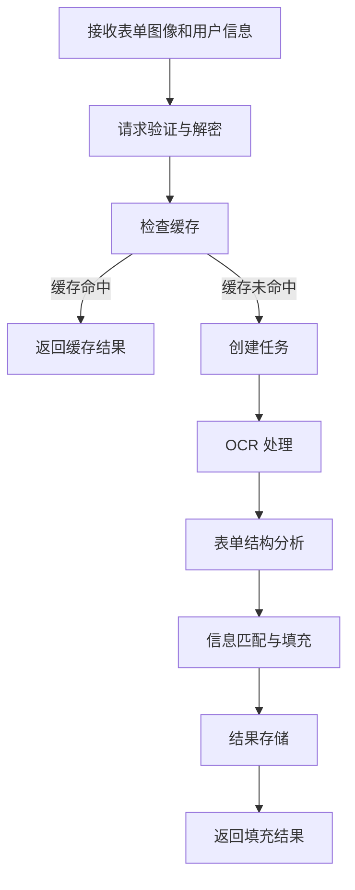

# 表单自动填充流程

表单自动填充是 DocuSnap-Backend 系统的高级功能，用于根据用户提供的信息自动填充表单，提高填表效率。本页面详细介绍表单自动填充的完整流程。

## 流程概述

表单自动填充流程将空白表单图像和用户提供的信息作为输入，生成填充后的表单数据。整个流程包括表单结构分析、信息匹配、智能填充和结果生成等步骤。



## 详细流程

### 1. 请求接收与验证

表单自动填充流程从接收客户端请求开始：

1. **接收请求**：
   - 客户端通过 `/api/process_form_filling` 端点发送请求
   - 请求包含加密的表单图像（Base64 格式）和用户信息
   - 请求使用 RSA 和 AES 混合加密

2. **请求解密**：
   - 使用 RSA 私钥解密 AES 密钥
   - 使用 AES 密钥解密请求数据
   - 验证请求签名，确保数据完整性

3. **参数验证**：
   - 验证请求参数是否完整
   - 验证图像格式是否正确
   - 验证用户信息格式是否正确

**代码示例**：

```python
@app.route('/api/process_form_filling', methods=['POST'])
def process_form_filling():
    try:
        # 解密请求
        if not request.is_json:
            return jsonify({"error": "请求必须是JSON格式"}), 400
        
        data = request.get_json()
        
        # 验证必要参数
        required_fields = ['encrypted_data', 'encrypted_key', 'signature']
        for field in required_fields:
            if field not in data:
                return jsonify({"error": f"缺少必要参数: {field}"}), 400
        
        # 解密请求数据
        try:
            decrypted_data, aes_key = decrypt_request(
                data['encrypted_data'],
                data['encrypted_key'],
                data['signature']
            )
        except Exception as e:
            return jsonify({"error": f"请求解密失败: {str(e)}"}), 400
        
        # 验证解密后的数据
        if 'images' not in decrypted_data or not isinstance(decrypted_data['images'], list):
            return jsonify({"error": "缺少images参数或格式不正确"}), 400
        
        if 'user_data' not in decrypted_data or not isinstance(decrypted_data['user_data'], dict):
            return jsonify({"error": "缺少user_data参数或格式不正确"}), 400
        
        if len(decrypted_data['images']) == 0:
            return jsonify({"error": "至少需要提供一张图像"}), 400
        
        if len(decrypted_data['images']) > MAX_IMAGES:
            return jsonify({"error": f"图像数量超过限制（最大 {MAX_IMAGES} 张）"}), 400
        
        # 处理请求...
```

### 2. 缓存检查与任务创建

在处理请求之前，系统会检查是否有缓存的结果，以避免重复计算：

1. **缓存检查**：
   - 根据请求参数生成缓存键
   - 查询数据库是否有匹配的缓存结果
   - 如果缓存命中，直接返回缓存结果

2. **任务创建**：
   - 如果缓存未命中，生成唯一的任务 ID
   - 创建任务记录，设置状态为"待处理"
   - 将任务添加到处理队列

3. **返回任务 ID**：
   - 向客户端返回任务 ID
   - 客户端可以使用任务 ID 查询处理状态和结果

**代码示例**：

```python
# 检查缓存
cache_key = sha256_hash(json.dumps(decrypted_data, sort_keys=True))
cached_result = check_cache(cache_key)

if cached_result:
    # 返回缓存结果
    response = encrypt_response(cached_result, aes_key)
    return jsonify(response), 200

# 创建任务
task_id = str(uuid.uuid4())
create_task_record(task_id, 'form_filling')

# 构建任务对象
task = {
    'id': task_id,
    'type': 'form_filling',
    'data': decrypted_data,
    'cache_key': cache_key,
    'aes_key': aes_key
}

# 添加任务到队列
add_task_to_queue(task)

# 返回任务 ID
response = encrypt_response({'task_id': task_id}, aes_key)
return jsonify(response), 202  # 202 Accepted
```

### 3. OCR 处理

任务进入队列后，工作线程会执行 OCR 处理，与表单处理流程类似：

1. **图像预处理**：
   - 解码 Base64 图像
   - 进行必要的图像优化

2. **OCR 服务调用**：
   - 调用 CnOCR 服务进行文本识别
   - 并行处理多个图像，提高效率

3. **OCR 结果处理**：
   - 收集所有图像的 OCR 结果
   - 合并为完整的文本内容

### 4. 表单结构分析

OCR 处理完成后，系统会分析表单结构：

1. **字段识别**：
   - 识别表单中的所有字段
   - 确定字段的位置和类型
   - 识别必填字段和选填字段

2. **结构映射**：
   - 将表单结构映射为字段列表
   - 确定字段之间的关系
   - 识别字段的分组和类别

### 5. 信息匹配与填充

表单结构分析完成后，系统会将用户提供的信息与表单字段进行匹配：

1. **信息匹配**：
   - 将用户信息与表单字段进行匹配
   - 处理字段名称的变体和同义词
   - 考虑字段的上下文和类别

2. **智能填充**：
   - 根据匹配结果填充表单字段
   - 对于缺失的必填字段，标记为"缺失"
   - 对于可以推断的字段，尝试合理推断

3. **格式调整**：
   - 根据字段类型调整值的格式
   - 确保填充值符合字段的要求
   - 处理特殊格式的字段（如日期、电话号码等）

**代码示例**：

```python
def process_form_filling_task(task):
    """处理表单填充类型的任务"""
    update_task_status(task['id'], 'processing')
    
    try:
        # 处理图像
        ocr_results = process_images(task['data']['images'])
        
        # 获取用户数据
        user_data = task['data']['user_data']
        
        # 构建提示并调用 LLM
        prompt = build_form_filling_prompt(ocr_results, user_data)
        llm_result = call_llm_api(prompt)
        
        # 解析结果
        parsed_result = parse_form_filling_result(llm_result)
        
        # 格式化结果
        final_result = format_form_filling_result(parsed_result)
        
        # 更新任务状态和结果
        update_task_status(task['id'], 'completed', final_result)
        
        # 存储缓存
        store_cache(task['cache_key'], final_result)
        
    except Exception as e:
        update_task_status(task['id'], 'error', {"error": str(e)})
        raise
```

### 6. 结果处理

信息匹配与填充完成后，系统会处理和存储结果：

1. **结果格式化**：
   - 将填充结果转换为标准格式
   - 添加元数据（如处理时间、来源等）
   - 确保输出格式的一致性

2. **结果存储**：
   - 更新任务状态为"已完成"
   - 存储处理结果
   - 将结果添加到缓存

3. **错误处理**：
   - 如果处理过程中出现错误，记录错误信息
   - 更新任务状态为"错误"
   - 存储错误详情

**代码示例**：

```python
def format_form_filling_result(parsed_result):
    """格式化表单填充结果"""
    # 确保结果包含必要的字段
    result = {
        "form_title": parsed_result.get("form_title", "未知表单"),
        "filled_fields": parsed_result.get("filled_fields", []),
        "missing_fields": parsed_result.get("missing_fields", []),
        "complete": parsed_result.get("complete", False),
        "metadata": {
            "processed_at": int(time.time()),
            "source": "form_filling"
        }
    }
    
    # 确保每个字段都有必要的属性
    for field in result["filled_fields"]:
        if "name" not in field:
            field["name"] = "未命名字段"
        if "value" not in field:
            field["value"] = ""
        if "source" not in field:
            field["source"] = "unknown"
    
    return result
```

### 7. 状态查询与结果返回

客户端可以使用任务 ID 查询处理状态和结果，这一步骤与其他流程类似。

## 表单填充提示

表单自动填充流程使用专门设计的提示模板，引导 LLM 将用户信息与表单字段匹配：

```
你是一个专业的表单填充助手。请根据用户提供的信息，填充以下表单。

表单内容：
{form_text}

用户信息：
{user_data}

请执行以下任务：
1. 分析表单结构，识别所有需要填写的字段
2. 将用户提供的信息与表单字段进行匹配
3. 对于缺失的必填字段，标记为"缺失"
4. 对于可以推断的字段，尝试合理推断

请以JSON格式输出结果，包含以下字段：
- form_title: 表单标题
- filled_fields: 已填充的字段列表，每个字段包含：
  - name: 字段名称
  - value: 填充的值
  - source: 值的来源（"user_provided", "inferred", "default"）
- missing_fields: 缺失的必填字段列表
- complete: 表单是否完整填写（布尔值）
```

这个提示模板指导 LLM 将用户提供的信息与表单字段进行匹配，并生成填充后的表单数据。

## 处理结果示例

表单自动填充流程的输出是结构化的 JSON 数据，包含填充后的表单字段：

```json
{
  "form_title": "个人信息登记表",
  "filled_fields": [
    {
      "name": "姓名",
      "value": "李明",
      "source": "user_provided"
    },
    {
      "name": "性别",
      "value": "男",
      "source": "user_provided"
    },
    {
      "name": "出生日期",
      "value": "1985-07-15",
      "source": "user_provided"
    },
    {
      "name": "身份证号",
      "value": "310************789",
      "source": "user_provided"
    },
    {
      "name": "手机号码",
      "value": "139********",
      "source": "user_provided"
    },
    {
      "name": "电子邮箱",
      "value": "liming@example.com",
      "source": "user_provided"
    },
    {
      "name": "通讯地址",
      "value": "上海市黄浦区人民广场",
      "source": "user_provided"
    },
    {
      "name": "邮政编码",
      "value": "200001",
      "source": "inferred"
    },
    {
      "name": "学历",
      "value": "硕士",
      "source": "user_provided"
    },
    {
      "name": "毕业院校",
      "value": "复旦大学",
      "source": "user_provided"
    },
    {
      "name": "专业",
      "value": "金融学",
      "source": "user_provided"
    }
  ],
  "missing_fields": [
    "工作单位",
    "职位"
  ],
  "complete": false,
  "metadata": {
    "processed_at": 1679012345,
    "source": "form_filling"
  }
}
```

## 表单自动填充的特殊考量

表单自动填充与其他流程相比，有一些特殊的考量：

1. **信息匹配**：
   - 处理字段名称的变体和同义词
   - 考虑字段的上下文和类别
   - 处理不同格式的用户信息

2. **智能推断**：
   - 根据已有信息推断缺失字段
   - 处理依赖关系（如根据城市推断邮政编码）
   - 提供合理的默认值

3. **完整性检查**：
   - 识别必填字段和选填字段
   - 检查表单是否完整填写
   - 标识缺失的必要信息

4. **格式适配**：
   - 根据字段要求调整值的格式
   - 处理特殊格式的字段
   - 确保填充值符合表单规范

## 错误处理

表单自动填充流程实现了全面的错误处理机制，除了通用的错误处理外，还包括一些特定于表单填充的错误处理：

1. **信息匹配错误**：
   - 用户信息与表单字段无法匹配
   - 用户信息格式不符合要求
   - 用户信息不完整

2. **推断错误**：
   - 无法推断缺失字段
   - 推断结果不可靠
   - 推断依赖的信息不足

## 性能优化

表单自动填充流程实现了多种性能优化措施，除了通用的优化外，还包括一些特定于表单填充的优化：

1. **字段映射缓存**：
   - 缓存常见表单的字段映射
   - 提高匹配效率和准确性
   - 减少 LLM 调用次数

2. **用户信息预处理**：
   - 标准化用户信息格式
   - 提取关键信息
   - 优化匹配算法

通过这些设计和实现，表单自动填充流程能够高效、可靠地将用户信息与表单字段匹配，生成填充后的表单数据，为用户提供便捷的表单填写服务。