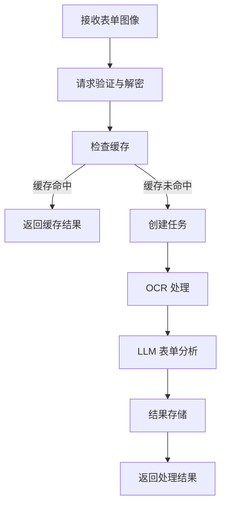

# 表单处理流程

表单处理是 DocuSnap-Backend 系统的核心功能之一，用于从表单图像中提取字段和值，并将其转换为结构化数据。本页面详细介绍表单处理的完整流程。

## 流程概述

表单处理流程将表单图像转换为结构化的字段-值对数据，包括表单标题、类型、字段分类等信息。整个流程包括图像处理、OCR 识别、LLM 分析和结果生成等步骤。



## 详细流程

### 1. 请求接收与验证

表单处理流程从接收客户端请求开始：

1. **接收请求**：
   - 客户端通过 `/api/process_form` 端点发送请求
   - 请求包含加密的表单图像（Base64 格式）
   - 请求使用 RSA 和 AES 混合加密

2. **请求解密**：
   - 使用 RSA 私钥解密 AES 密钥
   - 使用 AES 密钥解密请求数据
   - 验证请求签名，确保数据完整性

3. **参数验证**：
   - 验证请求参数是否完整
   - 验证图像格式是否正确
   - 验证图像数量是否在允许范围内

**代码示例**：

```python
@app.route('/api/process_form', methods=['POST'])
def process_form():
    try:
        # 解密请求
        if not request.is_json:
            return jsonify({"error": "请求必须是JSON格式"}), 400
        
        data = request.get_json()
        
        # 验证必要参数
        required_fields = ['encrypted_data', 'encrypted_key', 'signature']
        for field in required_fields:
            if field not in data:
                return jsonify({"error": f"缺少必要参数: {field}"}), 400
        
        # 解密请求数据
        try:
            decrypted_data, aes_key = decrypt_request(
                data['encrypted_data'],
                data['encrypted_key'],
                data['signature']
            )
        except Exception as e:
            return jsonify({"error": f"请求解密失败: {str(e)}"}), 400
        
        # 验证解密后的数据
        if 'images' not in decrypted_data or not isinstance(decrypted_data['images'], list):
            return jsonify({"error": "缺少images参数或格式不正确"}), 400
        
        if len(decrypted_data['images']) == 0:
            return jsonify({"error": "至少需要提供一张图像"}), 400
        
        if len(decrypted_data['images']) > MAX_IMAGES:
            return jsonify({"error": f"图像数量超过限制（最大 {MAX_IMAGES} 张）"}), 400
        
        # 处理请求...
```

### 2. 缓存检查与任务创建

在处理请求之前，系统会检查是否有缓存的结果，以避免重复计算：

1. **缓存检查**：
   - 根据请求参数生成缓存键
   - 查询数据库是否有匹配的缓存结果
   - 如果缓存命中，直接返回缓存结果

2. **任务创建**：
   - 如果缓存未命中，生成唯一的任务 ID
   - 创建任务记录，设置状态为"待处理"
   - 将任务添加到处理队列

3. **返回任务 ID**：
   - 向客户端返回任务 ID
   - 客户端可以使用任务 ID 查询处理状态和结果

**代码示例**：

```python
# 检查缓存
cache_key = sha256_hash(json.dumps(decrypted_data, sort_keys=True))
cached_result = check_cache(cache_key)

if cached_result:
    # 返回缓存结果
    response = encrypt_response(cached_result, aes_key)
    return jsonify(response), 200

# 创建任务
task_id = str(uuid.uuid4())
create_task_record(task_id, 'form')

# 构建任务对象
task = {
    'id': task_id,
    'type': 'form',
    'data': decrypted_data,
    'cache_key': cache_key,
    'aes_key': aes_key
}

# 添加任务到队列
add_task_to_queue(task)

# 返回任务 ID
response = encrypt_response({'task_id': task_id}, aes_key)
return jsonify(response), 202  # 202 Accepted
```

### 3. OCR 处理

任务进入队列后，工作线程会执行 OCR 处理：

1. **图像预处理**：
   - 解码 Base64 图像
   - 进行必要的图像优化（如调整大小、增强对比度等）

2. **OCR 服务调用**：
   - 调用 CnOCR 服务进行文本识别
   - 并行处理多个图像，提高效率
   - 使用信号量控制并发度

3. **OCR 结果处理**：
   - 收集所有图像的 OCR 结果
   - 合并为完整的文本内容
   - 准备用于 LLM 分析的输入

表单处理的 OCR 步骤与文档处理类似，但可能会针对表单结构进行特殊优化，如保留文本的空间位置信息，以便更好地识别表单结构。

### 4. LLM 处理

OCR 处理完成后，系统会使用 LLM 分析表单内容：

1. **提示构建**：
   - 使用表单处理的提示模板
   - 将 OCR 文本插入提示模板
   - 指导 LLM 识别表单字段和值

2. **LLM API 调用**：
   - 调用智谱 AI 的 LLM API
   - 发送构建的提示
   - 接收 LLM 的响应

3. **响应解析**：
   - 解析 LLM 返回的文本
   - 提取 JSON 格式的结构化数据
   - 处理可能的格式问题

**代码示例**：

```python
def process_form_task(task):
    """处理表单类型的任务"""
    update_task_status(task['id'], 'processing')
    
    try:
        # 处理图像
        ocr_results = process_images(task['data']['images'])
        
        # 构建提示并调用 LLM
        prompt = build_form_prompt(ocr_results)
        llm_result = call_llm_api(prompt)
        
        # 解析结果
        parsed_result = parse_form_result(llm_result)
        
        # 格式化结果
        final_result = format_form_result(parsed_result)
        
        # 更新任务状态和结果
        update_task_status(task['id'], 'completed', final_result)
        
        # 存储缓存
        store_cache(task['cache_key'], final_result)
        
    except Exception as e:
        update_task_status(task['id'], 'error', {"error": str(e)})
        raise
```

### 5. 结果处理

LLM 处理完成后，系统会处理和存储结果：

1. **结果格式化**：
   - 将解析后的 LLM 结果转换为标准格式
   - 添加元数据（如处理时间、来源等）
   - 确保输出格式的一致性

2. **结果存储**：
   - 更新任务状态为"已完成"
   - 存储处理结果
   - 将结果添加到缓存

3. **错误处理**：
   - 如果处理过程中出现错误，记录错误信息
   - 更新任务状态为"错误"
   - 存储错误详情

**代码示例**：

```python
def format_form_result(parsed_result):
    """格式化表单处理结果"""
    # 确保结果包含必要的字段
    result = {
        "form_title": parsed_result.get("form_title", "未知表单"),
        "form_type": parsed_result.get("form_type", "未知类型"),
        "fields": parsed_result.get("fields", []),
        "metadata": parsed_result.get("metadata", {}),
        "processing_metadata": {
            "processed_at": int(time.time()),
            "source": "form_processing"
        }
    }
    
    # 确保每个字段都有必要的属性
    for field in result["fields"]:
        if "name" not in field:
            field["name"] = "未命名字段"
        if "value" not in field:
            field["value"] = ""
        if "category" not in field:
            field["category"] = "其他"
    
    return result
```

### 6. 状态查询与结果返回

客户端可以使用任务 ID 查询处理状态和结果，这一步骤与文档处理流程类似。

## 表单处理提示

表单处理流程使用专门设计的提示模板，引导 LLM 识别表单字段和值：

```
你是一个专业的表单分析助手。请分析以下表单内容，提取所有字段及其值。

表单内容：
{form_text}

请执行以下任务：
1. 识别表单的类型和标题
2. 提取所有字段名称和对应的值
3. 对字段进行分类（个人信息、联系方式、其他信息等）

请以JSON格式输出结果，包含以下字段：
- form_title: 表单标题
- form_type: 表单类型
- fields: 字段列表，每个字段包含：
  - name: 字段名称
  - value: 字段值
  - category: 字段类别
- metadata: 表单元数据，包含表单ID、日期等信息（如果有）
```

这个提示模板指导 LLM 从表单中提取字段和值，并对字段进行分类，以结构化的 JSON 格式输出结果。

## 处理结果示例

表单处理流程的输出是结构化的 JSON 数据，包含表单的字段和值：

```json
{
  "form_title": "个人信息登记表",
  "form_type": "登记表",
  "fields": [
    {
      "name": "姓名",
      "value": "张三",
      "category": "个人信息"
    },
    {
      "name": "性别",
      "value": "男",
      "category": "个人信息"
    },
    {
      "name": "出生日期",
      "value": "1990-01-01",
      "category": "个人信息"
    },
    {
      "name": "身份证号",
      "value": "310************123",
      "category": "个人信息"
    },
    {
      "name": "手机号码",
      "value": "138********",
      "category": "联系方式"
    },
    {
      "name": "电子邮箱",
      "value": "zhangsan@example.com",
      "category": "联系方式"
    },
    {
      "name": "通讯地址",
      "value": "上海市浦东新区张江高科技园区",
      "category": "联系方式"
    },
    {
      "name": "学历",
      "value": "本科",
      "category": "教育背景"
    },
    {
      "name": "毕业院校",
      "value": "上海大学",
      "category": "教育背景"
    },
    {
      "name": "专业",
      "value": "计算机科学与技术",
      "category": "教育背景"
    },
    {
      "name": "工作单位",
      "value": "ABC科技有限公司",
      "category": "工作信息"
    },
    {
      "name": "职位",
      "value": "软件工程师",
      "category": "工作信息"
    }
  ],
  "metadata": {
    "form_id": "REG20230001",
    "creation_date": "2023-03-15"
  },
  "processing_metadata": {
    "processed_at": 1679012345,
    "source": "form_processing"
  }
}
```

## 表单处理的特殊考量

表单处理与文档处理相比，有一些特殊的考量：

1. **结构识别**：
   - 表单通常有明确的结构，包括字段名和字段值
   - 需要准确识别字段之间的关系
   - 处理表格、复选框、单选按钮等特殊元素

2. **字段分类**：
   - 将字段分类为不同的类别（如个人信息、联系方式等）
   - 帮助用户更好地理解表单结构
   - 支持后续的数据处理和分析

3. **值类型识别**：
   - 识别字段值的类型（如文本、日期、数字等）
   - 处理特殊格式的值（如身份证号、电话号码等）
   - 确保值的格式一致性

4. **空值处理**：
   - 识别未填写的字段
   - 区分空值和无法识别的值
   - 提供适当的默认值或标记

## 错误处理

表单处理流程实现了全面的错误处理机制，与文档处理流程类似，但可能会有一些特定于表单的错误处理：

1. **表单结构错误**：
   - 无法识别表单结构
   - 字段名和值无法匹配
   - 表单格式不规范

2. **字段识别错误**：
   - 无法识别某些字段
   - 字段分类错误
   - 字段值解析错误

## 性能优化

表单处理流程实现了多种性能优化措施，与文档处理流程类似，但可能会有一些特定于表单的优化：

1. **表单模板识别**：
   - 识别常见的表单模板
   - 使用预定义的字段映射
   - 提高处理效率和准确性

2. **字段位置学习**：
   - 学习字段在表单中的位置模式
   - 优化字段识别算法
   - 提高处理准确性

通过这些设计和实现，表单处理流程能够高效、可靠地从表单图像中提取结构化数据，为用户提供有价值的表单处理服务。