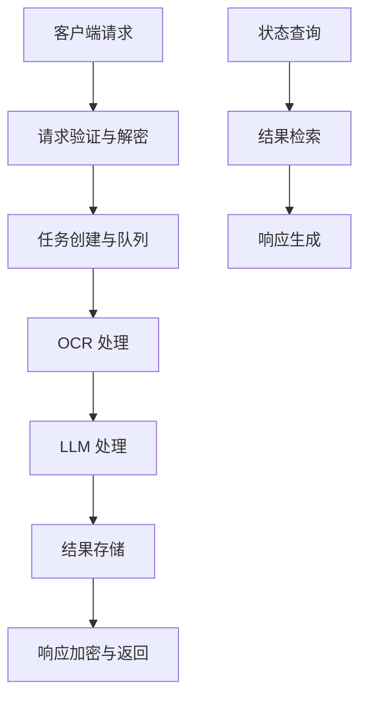
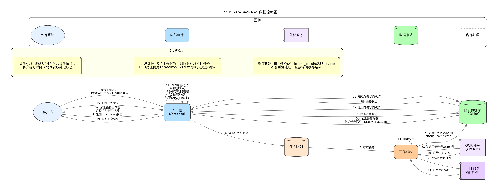

# 流程概述

DocuSnap-Backend 系统支持三种主要的业务流程：文档处理、表单处理和表单自动填充。这些流程共享相似的处理架构，但在细节上有所不同，以适应不同的业务需求。本页面提供这些流程的概述。

## 主要业务流程

DocuSnap-Backend 系统支持以下三种主要业务流程：

1. **文档处理流程**：
   - 将文档图像转换为文本
   - 分析文档结构和内容
   - 提取关键信息
   - 生成结构化的文档数据

2. **表单处理流程**：
   - 将表单图像转换为文本
   - 识别表单字段和值
   - 提取字段-值对
   - 生成结构化的表单数据

3. **表单自动填充流程**：
   - 分析空白表单结构
   - 匹配用户提供的信息与表单字段
   - 生成填充后的表单数据
   - 标识缺失的必要信息

## 通用处理架构

尽管三种业务流程在细节上有所不同，但它们共享一个通用的处理架构：

这个通用架构包括以下关键步骤：

1. **请求接收与验证**：
   - 接收客户端的加密请求
   - 解密请求数据
   - 验证请求参数和格式

2. **任务管理**：
   - 创建任务记录
   - 将任务添加到处理队列
   - 分配工作线程处理任务

3. **OCR 处理**：
   - 处理图像，提取文本内容
   - 并行处理多个图像
   - 合并 OCR 结果

4. **LLM 处理**：
   - 根据任务类型构建提示
   - 调用 LLM API 分析文本
   - 解析 LLM 响应

5. **结果处理**：
   - 存储处理结果
   - 更新任务状态
   - 加密响应数据

6. **状态查询**：
   - 客户端查询任务状态
   - 检索任务结果
   - 返回状态或结果

## 流程差异

虽然三种业务流程共享通用架构，但它们在以下方面存在差异：

### 1. 提示构建

每种流程使用不同的提示模板引导 LLM 进行特定类型的分析：

- **文档处理**：提示 LLM 分析文档结构、识别标题、段落、列表等，提取关键信息
- **表单处理**：提示 LLM 识别表单字段和值，提取字段-值对
- **表单填充**：提示 LLM 将用户提供的信息与表单字段匹配，生成填充后的表单数据

### 2. 输入参数

不同流程接受不同的输入参数：

- **文档处理**：仅接受文档图像
- **表单处理**：仅接受表单图像
- **表单填充**：接受表单图像和用户提供的信息

### 3. 结果格式

不同流程生成不同格式的结果：

- **文档处理**：生成包含文档结构和内容的 JSON 数据
- **表单处理**：生成包含字段-值对的 JSON 数据
- **表单填充**：生成包含填充字段和缺失字段的 JSON 数据

### 4. 处理策略

不同流程使用不同的处理策略：

- **文档处理**：侧重于理解文档结构和内容
- **表单处理**：侧重于准确识别字段和值
- **表单填充**：侧重于信息匹配和推断

## 数据流图

下图展示了 DocuSnap-Backend 系统中的数据流：

这个数据流图展示了从客户端请求到响应的完整数据流向，包括请求处理、任务执行、结果存储和响应处理等阶段。

## 异步处理模式

DocuSnap-Backend 系统采用异步处理模式，将请求接收和任务处理分离，提高系统响应能力和并发处理能力：

1. **请求接收**：
   - 客户端发送请求
   - 系统快速创建任务并返回任务 ID
   - 客户端不需要等待处理完成

2. **异步处理**：
   - 工作线程从队列获取任务
   - 执行 OCR 和 LLM 处理
   - 存储处理结果

3. **状态查询**：
   - 客户端使用任务 ID 查询状态
   - 系统返回当前状态或处理结果
   - 客户端可以定期轮询或实现回调机制

这种异步处理模式适合处理耗时的 OCR 和 LLM 操作，避免客户端长时间等待，提高用户体验。

## 错误处理

DocuSnap-Backend 系统实现了全面的错误处理机制，确保流程的可靠性和稳定性：

1. **请求验证错误**：
   - 参数缺失或格式错误
   - 解密失败或签名验证失败
   - 返回适当的错误代码和消息

2. **处理错误**：
   - OCR 处理失败
   - LLM API 调用失败
   - 结果解析失败
   - 记录错误信息，更新任务状态

3. **系统错误**：
   - 数据库操作失败
   - 资源不足
   - 服务不可用
   - 记录详细错误日志，返回通用错误消息

错误处理机制确保系统能够优雅地处理各种异常情况，提供清晰的错误反馈，并尽可能地恢复正常操作。

在接下来的页面中，我们将详细介绍每种业务流程的具体实现和数据流向。